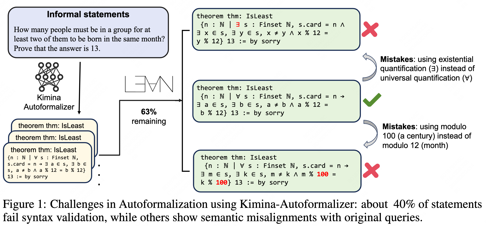
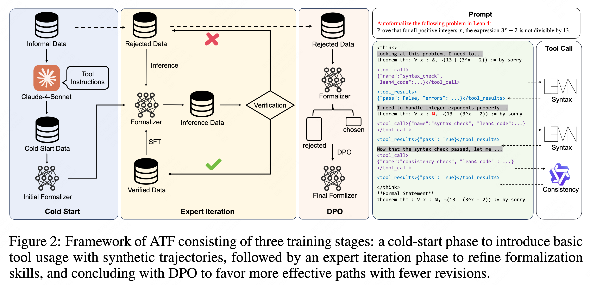
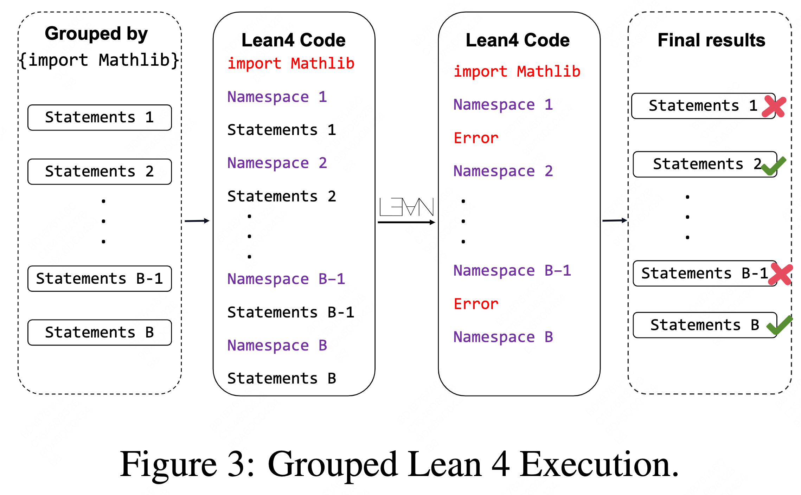
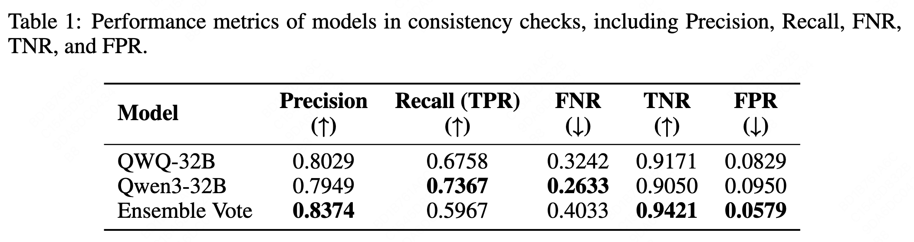
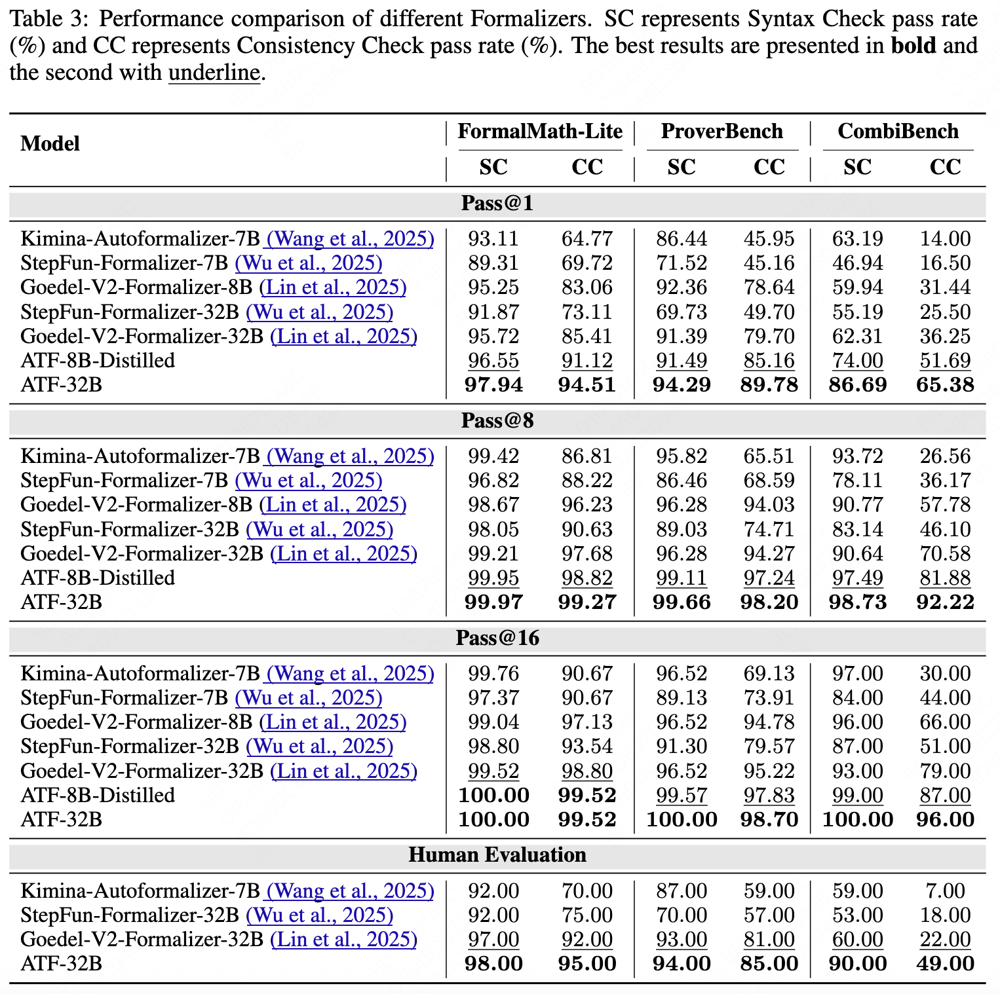
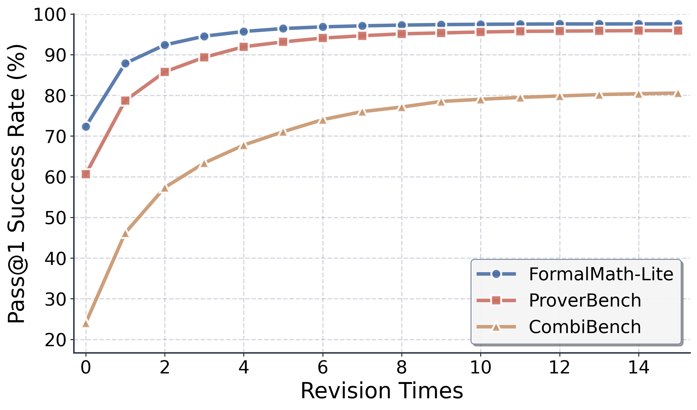
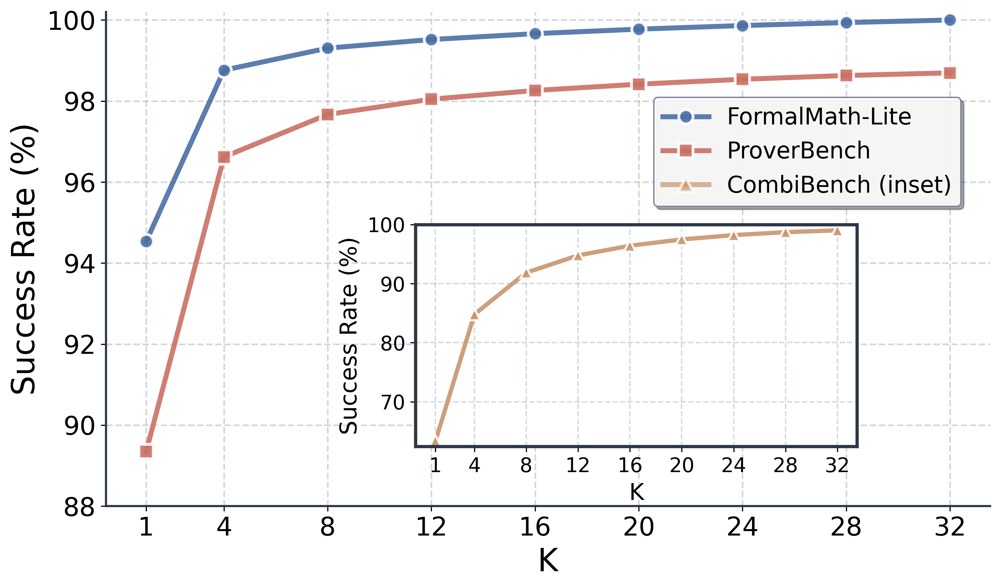

<div align="center"> 
  <a href="https://arxiv.org/pdf/2510.06857"></a> &ensp;
  <a href="https://huggingface.co/Buchilaguo/ATF-8B"></a> &ensp;
  <a href="https://huggingface.co/Buchilaguo/Numina-ATF"></a> &ensp;
  <a href="https://github.com/qguo-create/Autoformalizer-with-Tool-Feedback"></a> &ensp;
</div>
<br>

## Abstract
Autoformalization addresses the scarcity of data for Automated Theorem Proving (ATP) by translating mathematical problems from natural language into formal statements. 
Efforts in recent work shift from directly prompting large language models to training an end-to-end formalizer model from scratch, achieving remarkable advancements. 
However, existing formalizer still struggles to consistently generate valid statements that meet syntactic validity and semantic consistency. 
To address this issue, we propose the Autoformalizer with Tool Feedback (ATF), a novel approach that incorporates syntactic and consistency information as tools into the formalization process. 
By integrating Lean 4 compilers for syntax corrections and employing a multi-LLMs-as-judge approach for consistency validation, the model is able to adaptively refine generated statements according to the tool feedback, enhancing both syntactic validity and semantic consistency. 
The training of ATF involves a cold-start phase on synthetic tool-calling data, an expert iteration phase to improve formalization capabilities, and Direct Preference Optimization to alleviate ineffective revisions. 
Experimental results show that ATF markedly outperforms a range of baseline formalizer models, with its superior performance further validated by human evaluations.
Subsequent analysis reveals that ATF demonstrates excellent inference scaling properties.
Moreover, we open-source Numina-ATF, a dataset containing 750K synthetic formal statements to facilitate advancements in autoformalization and ATP research.

## Overview
Existing formalization approaches face the following issues: 
1. **Lack of Formal Knowledge**. The scarcity of formal language data in the pre-training corpora limits the foundational models’ ability to inherently understand and generate formal statements effectively.
2. **Rough Consistency Validation**. Previous work relies on LLMs to assess the consistency between informal and formal expressions. However, the reliability of such LLMs-as-judge approach has not been thoroughly validated.

To address these issues, we propose **Autoformalizer with Tool Feedback (ATF)**, which integrates syntactic and consistency information as tools into the formalization process, thereby guiding models to adaptively refine the statements during generation. Specifically, we develop distinct tools for syntactic validity and semantic consistency. The integration of syntactic information effectively compensates for the model’s unfamiliarity with formal language, allowing adjustments tailored to different language versions. Besides, the incorporation of consistency information helps the model to identify and address misalignments between informal and formal statements, enhancing semantic consistency. The training of ATF involves a cold-start phase on synthetic data to teach the model effective tool usage, an expert iteration phase to enhance the model’s formalization capability and its ability to effectively implement revisions based on tool feedback, followed by a Direct Preference Optimization (DPO) phase to reduce ineffective revisions. 


**Core Contributions**:

- We develop two evaluation tools that effectively assess the validity of formal statements, providing accurate measurements of both syntactic validity and semantic consistency.

- We propose Autoformalizer with Tool Feedback (ATF), which enables models to invoke evaluation tools during the formalization process and adjust statements based on feedback, achieving superior results compared to existing baseline formalizers.

- We open-source Numina-ATF, a formal dataset containing 750K formal statements from Numina-v1.5 queries synthesized by ATF-32B, supporting further development of formalizers and provers.

## Key Features

### Tool Integration

We design two distinct tools: **Syntax Check** for syntactic validity and **Consistency Check** for semantic consistency. 

- The syntactic validity tool processes formal statements and returns detailed compilation feedback from Lean 4 compilers. We employ a pre-check stage and a grouped execution method to ensure more stable and rapid tool responses.

<div style="display: flex; justify-content: center;">
    
</div>

- The consistency check receives pairs of informal and formal statements and returns consistency results along with concise explanations. We implement a multi-LLMs-as-judge approach in consistency check, which is benchmarked to effectively discriminate minor inconsistencies in formal statements.


### Progressive Training Pipeline

ATF is trained through a multi-phase process designed to optimize its formalization capabilities:

1. **Cold-Start Phase**: Introduces the model to tool usage with synthetic tool-calling data, establishing foundational formalization skills.
   
2. **Expert Iteration Phase**: Enhances the model's ability to generate valid formal statements through iterative refinement and feedback integration.

3. **Direct Preference Optimization (DPO)**: Reduces ineffective revisions by optimizing the model's decision-making process, ensuring efficient and effective formalization.

## Benchmark Performance

ATF has been rigorously evaluated across multiple benchmarks used in ATP, including two in-distribution datasets: **FormalMath-Lite** and **ProverBench**, along with an out-of-distribution dataset **CombiBench**. It excels in both in-distribution and out-of-distribution scenarios, demonstrating robust generalization capabilities. The model benefits significantly from increased sampling during inference, achieving remarkable pass rates even at higher sampling counts.

We assess both syntactic validity and consistency validity of generated statements using the tools designed above (only syntactically valid statements proceed to consistency evaluation), with further human evaluation as the gold standard.

**Experimental Summarizations**:

- ATF consistently outperforms all baseline models across all benchmarks on both syntax and consistency metrics.

- ATF demonstrates strong generalization capabilities in out-of-distribution scenarios. 

- Human evaluation validates both the effectiveness of the consistency check tool and the superior performance of ATF. 
<div style="display: flex; justify-content: center;">
    
</div>

- ATF can further benefit from increased parallel sampling and sequential revisions.
<div style="display: flex; justify-content: center; align-items: center;">
    
    
</div>

## Citation
```latex
@article{guo2025autoformalizer,
  title={Autoformalizer with Tool Feedback},
  author={Guo, Qi and Wang, Jianing and Zhang, Jianfei and Kong, Deyang and Huang, Xiangzhou and Xi, Xiangyu and Wang, Wei and Wang, Jingang and Cai, Xunliang and Zhang, Shikun and others},
  journal={arXiv preprint arXiv:2510.06857},
  year={2025}
}
```
